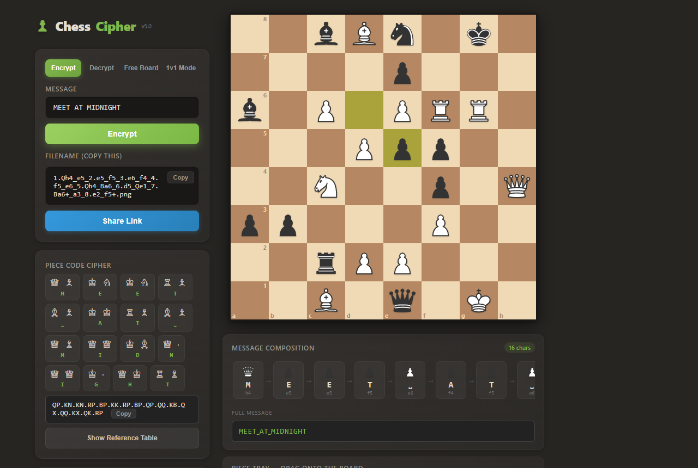
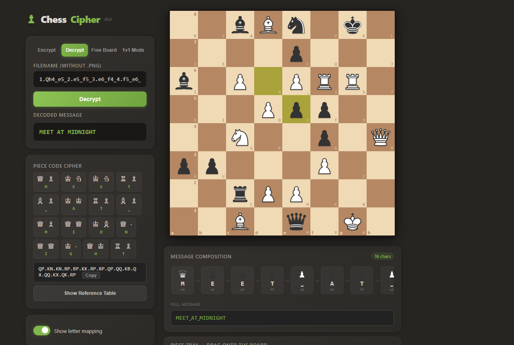
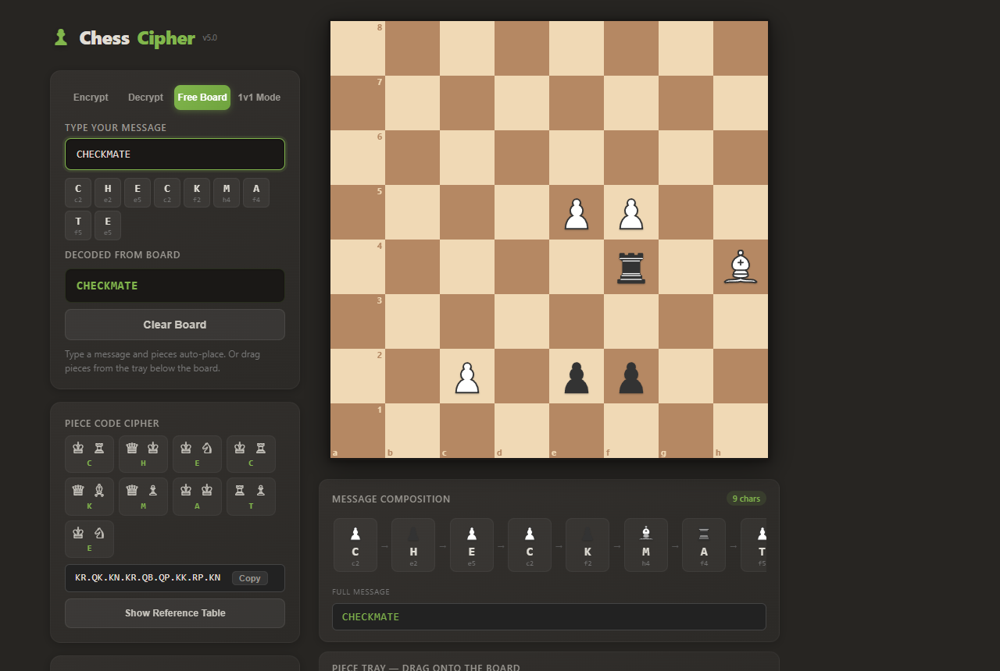

# ChessCipher

**Hide secret messages inside realistic chess board images.** The message is encoded in the image's **filename** as chess move notation (PGN-style), while the board itself is pure camouflage — filled with decoy pieces so nobody can tell which pieces carry the message.

Includes a self-contained browser app (`index.html`) and a Python command-line tool (`main.py`).

> Built with AI-assisted development.



| Decrypt (with letter-mapping overlay) | Free Board (type and pieces auto-place) |
|---|---|
|  |  |

## How It Works

1. **You type a message** like `HELLO WORLD`.
2. **Each character maps to a unique chess square** using a SHA-256 scrambled mapping (not sequential — you need the cipher seed to decode it).
3. **A realistic chess board is generated** with your message pieces + decoy pieces + both kings, so it looks like a real mid-game position.
4. **The filename IS the cipher** — it's formatted as chess moves: `1.Be2+_e5_2.Rxh8_Rh8_3.Bxa5_Be6.png`
5. **To decrypt**, paste the filename — the parser extracts the squares from the move notation and maps them back to characters.

The board image is never read during decryption. It's pure camouflage.

## What Makes It Convincing

- Both white and black pieces, always both kings present
- Realistic piece counts (max 2 rooks, 2 bishops, 2 knights, 1 queen per side for decoy pieces)
- Pawns never on impossible ranks (1st or 8th)
- A "last move" highlight that follows actual chess movement rules (sliding pieces don't jump over pieces, knights move in L-shapes, etc.)
- The filename looks like standard PGN game notation with move numbers, captures (`x`) and check symbols (`+`)
- Deterministic: the same message always produces the same board

## Features

### Web App (`index.html`) — recommended

A single self-contained HTML file with a much better visual experience than the Python script: drag-and-drop pieces, keyboard typing, animated transitions and multiple modes.

**Modes**

- **Encrypt** — type a message, watch the board populate with pieces, get the filename
- **Decrypt** — paste a filename, see the decoded message
- **Free Board** — type a message with your keyboard and pieces auto-place on the board. Each character appears as a deletable chip, which is much easier than dragging pieces one by one. You can still drag pieces from the tray.
- **1v1 Local Mode** — two-player encrypted messaging using chess pieces only. Players take turns composing and sending messages as chess board positions. The receiver sees only the pieces on the board — no plaintext. Toggle the letter overlay to decode the hidden message.
- **Piece-Name Cipher** — an alternative encoding using chess piece initials (K=King, Q=Queen, R=Rook, B=Bishop, N=Knight, P=Pawn). Each character maps to a 2-letter piece code (e.g. `HELLO` = `QK.KN.QN.QN.RK`), displayed as piece icons.

**UI features**

- Drag and drop pieces (pointer events, works on mobile)
- Keyboard typing in Free Board — just type and pieces appear
- Message editor strip below the board showing each character with its mapped square and piece — click any character to delete it
- Piece placement animations, transitions and toast notifications
- Toggle a letter overlay to see which character each square maps to
- Export the board as PNG
- Copy the filename with one click, or generate a share link (`#cipher=...`) that opens straight into Decrypt mode
- Staunton SVG chess pieces, dark chess.com-style theme, responsive layout

### Python CLI (`main.py`)

A command-line tool that renders the board to a PNG image with [pygame](https://www.pygame.org/) and names the file with the cipher. It uses the same character-to-square mapping as the web app, so filenames from either tool decrypt in both.

## Quick Start

### Web app

Open `index.html` in any modern browser — no build step and no dependencies to install. (It loads the `js-sha256` library from a CDN, so an internet connection is needed the first time.)

Or serve it locally:

```bash
python -m http.server 8000
# then open http://localhost:8000/index.html
```

### Python CLI

```bash
pip install pygame
python main.py
```

Pick `1` to encrypt or `2` to decrypt.

- **Encrypt:** type your message, get a PNG board image (saved next to `main.py`) whose filename encodes the cipher.
- **Decrypt:** paste the filename (without `.png`), get the original message back.

## Supported Characters

```
A B C D E F G H I J K L M N O P Q R S T U V W X Y Z [space] 0 1 2 3 4 5 6 7 8 9
```

37 characters total. Messages are automatically converted to uppercase.

## Quick Example

**Encrypt** `HELLO`:

```
Squares: e2 → H, e5 → E, h8 → L, h8 → L, a5 → O
Filename: 1.Be2+_e5_2.Rxh8_Rh8_3.a5.png
```

**Decrypt** — paste `1.Be2+_e5_2.Rxh8_Rh8_3.a5`:

```
Parser: Be2+ → e2, e5 → e5, Rxh8 → h8, Rh8 → h8, a5 → a5
Result: HELLO
```

## Project Structure

```
ChessCipher/
  index.html       # Interactive web app (self-contained, recommended)
  main.py          # Python encryption/decryption CLI (pygame)
  report.html      # Detailed technical documentation
  color/           # 16x16 pixel-art piece assets (used by main.py)
  docs/screenshots # README screenshots
  README.md
```

## Tech Stack

- **Web:** HTML, CSS, vanilla JavaScript, inline SVG pieces, [js-sha256](https://github.com/emn178/js-sha256), Canvas for PNG export
- **CLI:** Python 3, pygame, `hashlib` (SHA-256), `random` seeded per message

## Security

This is a **steganography/obfuscation** tool, not a military-grade cipher. It's designed to hide messages from casual observers, not to resist cryptanalysis.

**What it does well:**
- The board looks like a normal chess game screenshot
- The filename looks like normal chess notation
- The scrambled mapping means you need the cipher seed to decode
- The same message always produces the same board (reproducible)

**Known limitations:**
- The cipher seed is hardcoded — anyone with the source code can decrypt
- Repeated characters map to the same square, so frequency analysis is possible on long messages
- Messages are limited to ~50 characters (filename length)

For stronger security, change `CIPHER_SEED` (in both `index.html` and `main.py`) to a shared secret between sender and receiver.

## License

Do whatever you want with it.
